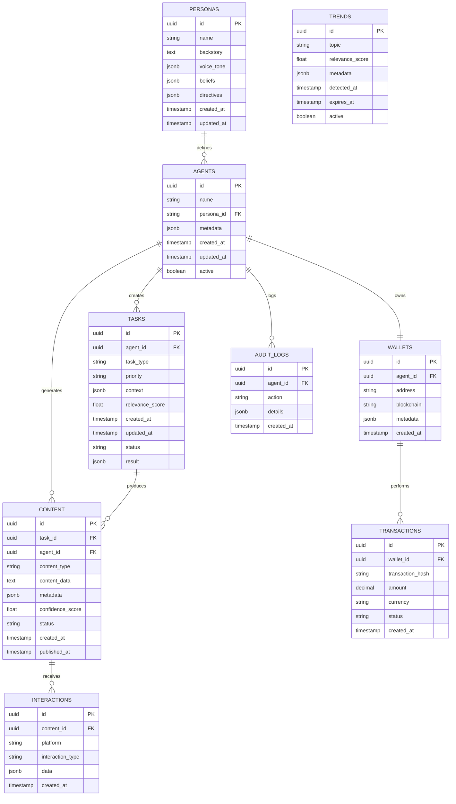

# Technical Specification — Project Chimera

## Architecture Pattern

- Swarm Pattern: Planner → Worker → Judge
- Integration Layer: MCP (Model Context Protocol)
- Storage:
  - Weaviate (Semantic Memory)
  - PostgreSQL (Transactional)
  - Redis (Queues + Cache)

---

## Database & Data Management

### Entity Relationship Diagram (ERD)



### PostgreSQL Schema (DDL)

```sql
-- Personas table for agent identities
CREATE TABLE personas (
    id UUID PRIMARY KEY DEFAULT gen_random_uuid(),
    name VARCHAR(255) NOT NULL,
    backstory TEXT,
    voice_tone JSONB,
    beliefs JSONB,
    directives JSONB,
    created_at TIMESTAMP WITH TIME ZONE DEFAULT NOW(),
    updated_at TIMESTAMP WITH TIME ZONE DEFAULT NOW()
);

-- Agents table
CREATE TABLE agents (
    id UUID PRIMARY KEY DEFAULT gen_random_uuid(),
    name VARCHAR(255) NOT NULL,
    persona_id UUID REFERENCES personas(id),
    metadata JSONB,
    created_at TIMESTAMP WITH TIME ZONE DEFAULT NOW(),
    updated_at TIMESTAMP WITH TIME ZONE DEFAULT NOW(),
    active BOOLEAN DEFAULT true
);

-- Tasks table
CREATE TABLE tasks (
    id UUID PRIMARY KEY DEFAULT gen_random_uuid(),
    agent_id UUID REFERENCES agents(id),
    task_type VARCHAR(100) NOT NULL CHECK (task_type IN ('generate_content', 'reply_comment', 'execute_transaction', 'fetch_trends')),
    priority VARCHAR(20) NOT NULL CHECK (priority IN ('high', 'medium', 'low')),
    context JSONB NOT NULL,
    relevance_score DECIMAL(3,2) CHECK (relevance_score >= 0.0 AND relevance_score <= 1.0),
    created_at TIMESTAMP WITH TIME ZONE DEFAULT NOW(),
    updated_at TIMESTAMP WITH TIME ZONE DEFAULT NOW(),
    status VARCHAR(50) DEFAULT 'pending' CHECK (status IN ('pending', 'in_progress', 'review', 'complete', 'failed')),
    result JSONB
);

-- Content table
CREATE TABLE content (
    id UUID PRIMARY KEY DEFAULT gen_random_uuid(),
    task_id UUID REFERENCES tasks(id),
    agent_id UUID REFERENCES agents(id),
    content_type VARCHAR(50) NOT NULL CHECK (content_type IN ('text', 'image', 'video', 'audio')),
    content_data TEXT NOT NULL,
    metadata JSONB,
    confidence_score DECIMAL(3,2) CHECK (confidence_score >= 0.0 AND confidence_score <= 1.0),
    status VARCHAR(50) DEFAULT 'draft' CHECK (status IN ('draft', 'approved', 'published', 'rejected')),
    created_at TIMESTAMP WITH TIME ZONE DEFAULT NOW(),
    published_at TIMESTAMP WITH TIME ZONE
);

-- Trends table
CREATE TABLE trends (
    id UUID PRIMARY KEY DEFAULT gen_random_uuid(),
    topic VARCHAR(500) NOT NULL,
    relevance_score DECIMAL(3,2) CHECK (relevance_score >= 0.0 AND relevance_score <= 1.0),
    metadata JSONB,
    detected_at TIMESTAMP WITH TIME ZONE DEFAULT NOW(),
    expires_at TIMESTAMP WITH TIME ZONE,
    active BOOLEAN DEFAULT true
);

-- Interactions table
CREATE TABLE interactions (
    id UUID PRIMARY KEY DEFAULT gen_random_uuid(),
    content_id UUID REFERENCES content(id),
    platform VARCHAR(100) NOT NULL,
    interaction_type VARCHAR(50) NOT NULL CHECK (interaction_type IN ('like', 'comment', 'share', 'view', 'click')),
    data JSONB,
    created_at TIMESTAMP WITH TIME ZONE DEFAULT NOW()
);

-- Wallets table
CREATE TABLE wallets (
    id UUID PRIMARY KEY DEFAULT gen_random_uuid(),
    agent_id UUID REFERENCES agents(id),
    address VARCHAR(255) NOT NULL,
    blockchain VARCHAR(50) NOT NULL,
    metadata JSONB,
    created_at TIMESTAMP WITH TIME ZONE DEFAULT NOW(),
    UNIQUE(agent_id, blockchain)
);

-- Transactions table
CREATE TABLE transactions (
    id UUID PRIMARY KEY DEFAULT gen_random_uuid(),
    wallet_id UUID REFERENCES wallets(id),
    transaction_hash VARCHAR(255) UNIQUE,
    amount DECIMAL(20,8) NOT NULL,
    currency VARCHAR(20) NOT NULL,
    status VARCHAR(50) DEFAULT 'pending' CHECK (status IN ('pending', 'confirmed', 'failed')),
    created_at TIMESTAMP WITH TIME ZONE DEFAULT NOW()
);

-- Audit logs table
CREATE TABLE audit_logs (
    id UUID PRIMARY KEY DEFAULT gen_random_uuid(),
    agent_id UUID REFERENCES agents(id),
    action VARCHAR(255) NOT NULL,
    details JSONB,
    created_at TIMESTAMP WITH TIME ZONE DEFAULT NOW()
);

-- Indexes for performance
CREATE INDEX idx_tasks_agent_id ON tasks(agent_id);
CREATE INDEX idx_tasks_status ON tasks(status);
CREATE INDEX idx_tasks_created_at ON tasks(created_at);
CREATE INDEX idx_content_agent_id ON content(agent_id);
CREATE INDEX idx_content_status ON content(status);
CREATE INDEX idx_content_created_at ON content(created_at);
CREATE INDEX idx_trends_active ON trends(active) WHERE active = true;
CREATE INDEX idx_trends_relevance ON trends(relevance_score DESC);
CREATE INDEX idx_interactions_content_id ON interactions(content_id);
CREATE INDEX idx_interactions_platform ON interactions(platform);
CREATE INDEX idx_audit_logs_agent_id ON audit_logs(agent_id);
CREATE INDEX idx_audit_logs_created_at ON audit_logs(created_at);
```

### Weaviate Schema Configuration

```json
{
  "classes": [
    {
      "class": "AgentMemory",
      "description": "Semantic memory for agents",
      "vectorizer": "text2vec-openai",
      "moduleConfig": {
        "text2vec-openai": {
          "model": "text-embedding-3-small",
          "type": "text"
        }
      },
      "properties": [
        {
          "name": "agentId",
          "dataType": ["uuid"],
          "description": "Agent identifier"
        },
        {
          "name": "memoryType",
          "dataType": ["string"],
          "description": "Type of memory (short_term, long_term, episodic)"
        },
        {
          "name": "content",
          "dataType": ["text"],
          "description": "Memory content"
        },
        {
          "name": "context",
          "dataType": ["text"],
          "description": "Context of the memory"
        },
        {
          "name": "importance",
          "dataType": ["number"],
          "description": "Importance score (0-1)"
        },
        {
          "name": "timestamp",
          "dataType": ["date"],
          "description": "When the memory was created"
        }
      ]
    },
    {
      "class": "TrendAnalysis",
      "description": "Trend analysis and patterns",
      "vectorizer": "text2vec-openai",
      "properties": [
        {
          "name": "topic",
          "dataType": ["string"],
          "description": "Trend topic"
        },
        {
          "name": "keywords",
          "dataType": ["text[]"],
          "description": "Associated keywords"
        },
        {
          "name": "sentiment",
          "dataType": ["string"],
          "description": "Sentiment analysis"
        },
        {
          "name": "platforms",
          "dataType": ["string[]"],
          "description": "Platforms where trend is active"
        },
        {
          "name": "metrics",
          "dataType": ["number[]"],
          "description": "Engagement metrics"
        },
        {
          "name": "detectedAt",
          "dataType": ["date"],
          "description": "Detection timestamp"
        }
      ]
    },
    {
      "class": "ContentEmbedding",
      "description": "Content embeddings for similarity search",
      "vectorizer": "text2vec-openai",
      "properties": [
        {
          "name": "contentId",
          "dataType": ["uuid"],
          "description": "Content identifier"
        },
        {
          "name": "contentType",
          "dataType": ["string"],
          "description": "Type of content"
        },
        {
          "name": "text",
          "dataType": ["text"],
          "description": "Text content for embedding"
        },
        {
          "name": "tags",
          "dataType": ["string[]"],
          "description": "Content tags"
        },
        {
          "name": "persona",
          "dataType": ["string"],
          "description": "Persona that created content"
        }
      ]
    }
  ]
}
```

### Redis Data Structure

```redis
# Task queues
tasks:pending:high -> List[task_id]
tasks:pending:medium -> List[task_id]
tasks:pending:low -> List[task_id]
tasks:processing -> Set[task_id]

# Agent state
agent:{agent_id}:state -> Hash{
  status: "idle|busy|error",
  current_task: task_id,
  last_heartbeat: timestamp,
  capabilities: ["skill1", "skill2"]
}

# Rate limiting
rate_limit:{agent_id}:{action} -> TTL counter
rate_limit:global:{endpoint} -> TTL counter

# Cache
cache:trends:{topic_hash} -> JSON trend data (TTL: 1 hour)
cache:persona:{persona_id} -> JSON persona data (TTL: 24 hours)
cache:content:{content_id} -> JSON content data (TTL: 6 hours)

# Sessions
session:{session_id} -> Hash{
  agent_id: uuid,
  created_at: timestamp,
  last_activity: timestamp,
  context: JSON
}

# Metrics
metrics:tasks:completed:{hour} -> Counter
metrics:content:generated:{hour} -> Counter
metrics:errors:{agent_id}:{hour} -> Counter
```

### Data Lifecycle Management

#### Ingestion Pipeline
1. **Trend Data**: MCP sources → Redis cache → PostgreSQL → Weaviate embeddings
2. **Content Creation**: Agent output → PostgreSQL → Weaviate embeddings → Platform publishing
3. **Interactions**: Platform webhooks → PostgreSQL → Analytics aggregation
4. **Agent Memory**: Runtime → Redis (short-term) → Weaviate (long-term)

#### Transformation Rules
```python
# Data transformation examples
trend_transformation = {
    "input": "raw_mcp_data",
    "steps": [
        "normalize_timestamps",
        "extract_keywords",
        "calculate_relevance",
        "deduplicate",
        "store_in_postgres",
        "generate_embeddings",
        "index_in_weaviate"
    ]
}

content_transformation = {
    "input": "agent_generated_content",
    "steps": [
        "validate_persona_consistency",
        "moderation_check",
        "confidence_scoring",
        "store_in_postgres",
        "generate_embeddings",
        "queue_for_publishing"
    ]
}
```

#### Retention Policies
```yaml
retention_policies:
  postgresql:
    audit_logs: "2 years"
    tasks: "6 months"
    interactions: "1 year"
    transactions: "7 years"
    
  redis:
    cache_data: "1-24 hours"
    sessions: "7 days"
    rate_limits: "1 hour"
    
  weaviate:
    agent_memory: "indefinite"
    trend_analysis: "1 year"
    content_embeddings: "2 years"
```

#### Backup & Restore Strategy
```yaml
backup_strategy:
  postgresql:
    frequency: "daily"
    retention: "30 days"
    method: "pg_dump + WAL-E"
    storage: "S3 encrypted bucket"
    
  redis:
    frequency: "hourly"
    retention: "7 days"
    method: "RDB snapshots"
    storage: "local + S3"
    
  weaviate:
    frequency: "weekly"
    retention: "12 weeks"
    method: "backup module"
    storage: "S3 encrypted bucket"

restore_procedures:
  disaster_recovery:
    rto: "4 hours"
    rpo: "1 hour"
    steps: [
      "restore_postgresql_from_latest",
      "restore_redis_from_latest_snapshot",
      "restore_weaviate_from_latest_backup",
      "rebuild_indexes",
      "validate_data_integrity"
    ]
```

### Migration Plan

#### Version 1.0 → 1.1 Migration
```sql
-- Add new columns for enhanced tracking
ALTER TABLE tasks ADD COLUMN execution_time_ms INTEGER;
ALTER TABLE content ADD COLUMN engagement_metrics JSONB;
ALTER TABLE agents ADD COLUMN performance_score DECIMAL(3,2);

-- Create new indexes
CREATE INDEX CONCURRENTLY idx_tasks_execution_time ON tasks(execution_time_ms);
CREATE INDEX CONCURRENTLY idx_content_engagement ON content USING GIN(engagement_metrics);

-- Migrate existing data
UPDATE tasks SET execution_time_ms = EXTRACT(EPOCH FROM (updated_at - created_at)) * 1000 WHERE execution_time_ms IS NULL;
```

#### Data Validation Queries
```sql
-- Check data integrity
SELECT 
    'agents' as table_name, 
    COUNT(*) as total_rows,
    COUNT(CASE WHEN persona_id IS NULL THEN 1 END) as missing_personas
FROM agents
UNION ALL
SELECT 
    'tasks' as table_name,
    COUNT(*) as total_rows,
    COUNT(CASE WHEN agent_id IS NULL THEN 1 END) as missing_agents
FROM tasks;

-- Performance metrics
SELECT 
    DATE_TRUNC('hour', created_at) as hour,
    COUNT(*) as tasks_created,
    AVG(relevance_score) as avg_relevance
FROM tasks 
WHERE created_at > NOW() - INTERVAL '24 hours'
GROUP BY hour
ORDER BY hour DESC;
```

---

## Security Architecture

### Authentication & Authorization (AuthN/AuthZ)

#### Authentication Strategy
```yaml
authentication:
  primary_method: "OAuth 2.0 + JWT"
  providers:
    - "Google Workspace"
    - "Microsoft Azure AD"
    - "GitHub OAuth"
  
  jwt_configuration:
    algorithm: "RS256"
    issuer: "https://auth.chimera.ai"
    audience: "chimera-api"
    access_token_ttl: "15 minutes"
    refresh_token_ttl: "7 days"
    
  mfa_requirements:
    - "TOTP for admin users"
    - "WebAuthn for sensitive operations"
    - "SMS backup for recovery"
```

#### Authorization Model
```yaml
authorization:
  model: "Role-Based Access Control (RBAC) + Attribute-Based (ABAC)"
  
  roles:
    - name: "super_admin"
      description: "Full system access"
      permissions: ["*"]
      
    - name: "agent_operator"
      description: "Manage agents and tasks"
      permissions: [
        "agent:read", "agent:write", "agent:delete",
        "task:read", "task:write", "task:execute",
        "content:read", "content:moderate"
      ]
      
    - name: "content_reviewer"
      description: "Review and moderate content"
      permissions: [
        "content:read", "content:approve", "content:reject",
        "audit:read"
      ]
      
    - name: "analyst"
      description: "View analytics and reports"
      permissions: [
        "analytics:read", "reports:read",
        "trends:read", "metrics:read"
      ]
      
    - name: "api_user"
      description: "Limited API access"
      permissions: [
        "agent:read", "task:read",
        "content:read"
      ]

  resource_attributes:
    - "agent_id"
    - "persona_id"
    - "task_priority"
    - "content_sensitivity"
    - "data_classification"
```

### Secrets Management

#### Environment & Vault Configuration
```yaml
secrets_management:
  primary_vault: "HashiCorp Vault"
  backup_vault: "AWS Secrets Manager"
  
  vault_configuration:
    address: "https://vault.chimera.ai:8200"
    auth_method: "Kubernetes Auth"
    transit_engine: "transit"
    kv_engine: "kv-v2"
    
  secret_categories:
    database:
      - "postgresql_credentials"
      - "redis_credentials"
      - "weaviate_api_key"
      
    external_apis:
      - "openai_api_key"
      - "twitter_bearer_token"
      - "blockchain_private_keys"
      
    infrastructure:
      - "kubernetes_configs"
      - "ssl_certificates"
      - "monitoring_keys"

  rotation_policy:
    database_credentials: "90 days"
    api_keys: "30 days"
    certificates: "365 days"
    encryption_keys: "730 days"
```

#### Environment Variables Structure
```bash
# Core Application
CHIMERA_ENV=production
CHIMERA_VERSION=1.0.0
CHIMERA_LOG_LEVEL=info

# Database Connections (encrypted at rest)
DATABASE_URL=${vault:database/postgresql_url}
REDIS_URL=${vault:database/redis_url}
WEAVIATE_URL=${vault:database/weaviate_url}

# External Services
OPENAI_API_KEY=${vault:apis/openai_key}
TWITTER_BEARER_TOKEN=${vault:apis/twitter_token}
BLOCKCHAIN_RPC_URL=${vault:apis/blockchain_rpc}

# Security
JWT_SECRET=${vault:security/jwt_secret}
ENCRYPTION_KEY=${vault:security/encryption_key}
VAULT_ADDR=https://vault.chimera.ai:8200
VAULT_ROLE=chimera-app
```

### Rate Limiting & Throttling

#### Rate Limiting Strategy
```yaml
rate_limiting:
  implementation: "Redis + Sliding Window Algorithm"
  
  global_limits:
    api_requests:
      - endpoint: "/api/v1/*"
        requests_per_minute: 1000
        burst: 100
        
      - endpoint: "/api/v1/agents"
        requests_per_minute: 100
        burst: 20
        
      - endpoint: "/api/v1/content"
        requests_per_minute: 500
        burst: 50

  per_user_limits:
    authenticated_users:
      requests_per_minute: 100
      concurrent_requests: 10
      
    api_users:
      requests_per_minute: 1000
      concurrent_requests: 50
      
    anonymous_users:
      requests_per_minute: 10
      concurrent_requests: 2

  agent_limits:
    task_creation:
      per_agent_per_hour: 50
      total_system_per_hour: 1000
      
    content_generation:
      per_agent_per_hour: 25
      total_system_per_hour: 500
      
    external_api_calls:
      per_agent_per_hour: 100
      total_system_per_hour: 10000
```

#### Rate Limiting Headers
```http
X-RateLimit-Limit: 1000
X-RateLimit-Remaining: 847
X-RateLimit-Reset: 1640995200
X-RateLimit-Retry-After: 60
```

### Content Moderation Pipeline

#### Moderation Strategy
```yaml
moderation_pipeline:
  stages:
    - name: "pre_generation"
      checks:
        - "persona_compliance"
        - "content_guidelines"
        - "sensitivity_scanning"
        
    - name: "ai_review"
      model: "GPT-4 + Custom Classifier"
      checks:
        - "toxicity_detection"
        - "hate_speech_detection"
        - "misinformation_check"
        - "copyright_violation"
        confidence_threshold: 0.85
        
    - name: "human_review"
      triggers:
        - confidence_score < 0.7
        - sensitive_topic_detected
        - high_risk_content_type
      escalation_rules:
        - "financial_advice"
        - "medical_information"
        - "political_content"
        - "legal_advice"
        
    - name: "post_publication"
      monitoring:
        - "engagement_anomaly_detection"
        - "user_feedback_analysis"
        - "automated_flagging"
        - "compliance_reporting"

  content_categories:
    safe:
      - "general_information"
      - "entertainment"
      - "educational_content"
      
    sensitive:
      - "political_discussion"
      - "religious_content"
      - "social_issues"
      requires_review: true
      
    prohibited:
      - "hate_speech"
      - "illegal_activities"
      - "explicit_content"
      - "misinformation"
      auto_reject: true
```

### Security Controls & Forbidden Actions

#### Forbidden Actions List
```yaml
forbidden_actions:
  agents:
    - "Direct cryptocurrency transfers without CFO approval"
    - "Modification of system security settings"
    - "Access to other agents' private data"
    - "Self-modification of core directives"
    - "Bypass of content moderation"
    
  users:
    - "Export of bulk user data without authorization"
    - "Modification of audit logs"
    - "Access to system encryption keys"
    - "Bypass of rate limiting mechanisms"
    
  content:
    - "Generation of illegal or harmful content"
    - "Impersonation of real individuals"
    - "Distribution of false information"
    - "Violation of platform terms of service"
```

#### Resource Limits
```yaml
resource_limits:
  agents:
    max_concurrent_tasks: 10
    max_memory_usage: "2GB"
    max_cpu_usage: "50%"
    max_storage_quota: "10GB"
    
  content:
    max_text_length: 50000
    max_image_size: "10MB"
    max_video_duration: "10 minutes"
    max_file_uploads_per_hour: 100
    
  api:
    max_request_size: "10MB"
    max_response_time: "30 seconds"
    max_concurrent_connections: 1000
```

#### Escalation Triggers
```yaml
escalation_triggers:
  security:
    - "Failed login attempts > 5 in 5 minutes"
    - "Privilege escalation attempts"
    - "Access to restricted resources"
    - "Anomalous API usage patterns"
    
  content:
    - "Confidence score < 0.7 for sensitive topics"
    - "Multiple moderation flags in short time"
    - "User complaints about specific content"
    - "Detection of prohibited content patterns"
    
  system:
    - "Error rate > 5% for 10 minutes"
    - "Response time > 5 seconds for 5 minutes"
    - "Database connection failures"
    - "Memory usage > 90% for 5 minutes"

  escalation_procedures:
    level_1: "Automated response + Alert on-call"
    level_2: "Security team notification + Temporary restrictions"
    level_3: "Immediate service shutdown + Incident response"
```

### Security Monitoring & Audit

#### Security Metrics
```yaml
security_monitoring:
  real_time_alerts:
    - "Failed authentication attempts"
    - "Unauthorized access attempts"
    - "Privilege escalation events"
    - "Data exfiltration attempts"
    
  daily_reports:
    - "Access log analysis"
    - "Permission changes"
    - "Security policy violations"
    - "Vulnerability scan results"
    
  compliance_tracking:
    - "GDPR compliance metrics"
    - "SOC 2 controls monitoring"
    - "Data retention policy adherence"
    - "Privacy impact assessments"
```

#### Audit Trail Schema
```sql
CREATE TABLE security_audit_logs (
    id UUID PRIMARY KEY DEFAULT gen_random_uuid(),
    timestamp TIMESTAMP WITH TIME ZONE DEFAULT NOW(),
    user_id UUID,
    agent_id UUID,
    action VARCHAR(255) NOT NULL,
    resource_type VARCHAR(100),
    resource_id UUID,
    ip_address INET,
    user_agent TEXT,
    success BOOLEAN,
    error_message TEXT,
    risk_score INTEGER CHECK (risk_score >= 1 AND risk_score <= 10),
    metadata JSONB,
    created_at TIMESTAMP WITH TIME ZONE DEFAULT NOW()
);

-- Indexes for security queries
CREATE INDEX idx_security_audit_timestamp ON security_audit_logs(timestamp DESC);
CREATE INDEX idx_security_audit_user_id ON security_audit_logs(user_id);
CREATE INDEX idx_security_audit_action ON security_audit_logs(action);
CREATE INDEX idx_security_audit_risk_score ON security_audit_logs(risk_score DESC);
```

---

## API Contracts

### Agent Task Schema

```json
{
  "task_id": "uuid",
  "task_type": "generate_content | reply_comment | execute_transaction",
  "priority": "high | medium | low",
  "context": {
    "goal_description": "string",
    "persona_constraints": ["string"],
    "required_resources": ["mcp://news/latest"]
  },
  "created_at": "timestamp",
  "status": "pending | in_progress | review | complete"
}
